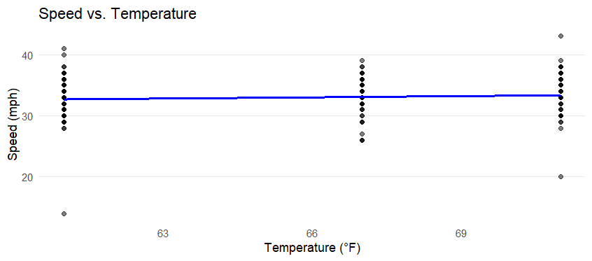
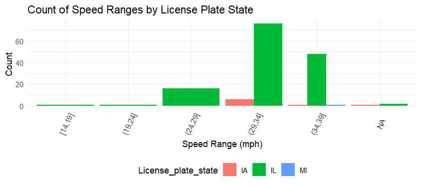
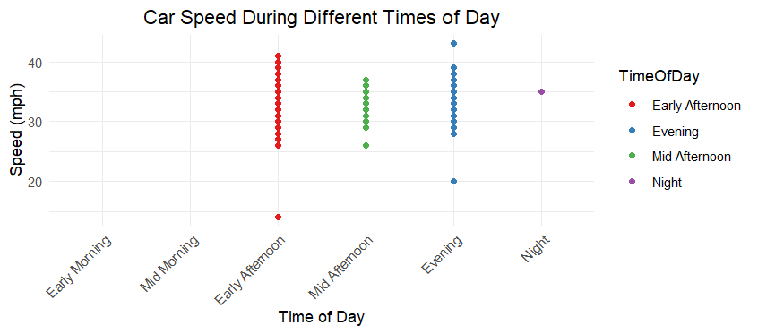

# Counting Cars🚗

## This repository presents the data analysis and findings from the Counting Cars project, where speeds of 150 vehicles were recorded. Conducted collaboratively by Waithira Ng'ang'a, Nicolas Navarro, and Avery Frick, the project offers insights into vehicle speed behavior in the area.
---
## Research Paper-- (https://averyfrick20.shinyapps.io/carShiny/) 
[Car Data Paper.pdf](https://github.com/waithiran22/Counting-Cars/files/15017757/Car.Data.Paper.pdf)

## Data Dictionary📖
The data for this project was collected individually from the speed rador on 30th St and 24th Avenue in Rock Island, IL.

Key Columns:

-Date: Date of the recorded observation.

-Temperature: Ambient temperature at the time of observation.

-Weather: Description of the prevailing weather conditions.

-Time: Timestamp of the observation.

-Speed: Vehicle speed captured by the radar.

-Color: Color of the vehicle.

-License Plate State: State of registration indicated by the license plate.

---

## Data Cleaning 🧹
The data cleaning process includes ensuring proper date, time and temperature formats, and preparing the data for analysis.

---
## Graphs and Analysis
Below are the plots generated from the collected data, along with the R code used to create each visual.

1. Distribution of Vehicle Speeds

This histogram shows the distribution of vehicle speeds with an overlay of the average speed marked by a dashed red line.

```
ggplot(car_data, aes(x = Speed)) +
  geom_histogram(binwidth = 5, fill = "#8A2BE2", color = "black") +
  geom_vline(aes(xintercept = mean(Speed)), color = "red", linetype = "dashed", size = 1) +
  ggtitle("Distribution of Vehicle Speeds") +
  xlab("Speed (mph)") +
  ylab("Frequency") +
  theme_minimal() +
  theme(plot.title = element_text(hjust = 0.5))
```

2. Speed Distribution by Weather Condition

This boxplot categorizes vehicle speeds by different weather conditions, showing variations in speed with weather changes.Vehicles tend to go faster when it's cloudy, as indicated by the higher median speed (central line of the purple box). The spread of speeds during sunny weather is greater, shown by the taller box, suggesting more variability in how fast people drive when it's sunny compared to cloudy weather.

```
ggplot(car_data, aes(x = Weather, y = Speed, fill = Weather)) +
  geom_boxplot() +
  scale_fill_manual(values = weather_colors) +
  ggtitle("Speed Distribution by Weather Condition") +
  xlab("Weather") +
  ylab("Speed (mph)") +
  theme_light()
```

3. Top 5 Car Colors in Each State
 

This bar chart displays the most common vehicle colors in the top five frequency for three different states. Black and white are prominent in Illinois, indicating a preference for standard car colors, while Iowa shows a notable count for grey and blue as well. Michigan has a strong presence of black vehicles.
```
ggplot(color_counts, aes(x = License_plate_state, y = Count, fill = Color)) +
  geom_bar(stat = "identity", position = position_dodge()) +
  scale_fill_manual(values = c("black" = "black", "blue" = "blue", "grey" = "grey", "red" = "red", "white" = "beige")) +
  labs(title = "Top 5 Car Colors in Each State",
       x = "State",
       y = "Count of Cars") +
  theme_minimal() +
  theme(plot.title = element_text(hjust = 0.5),
        legend.position = "bottom")
```
4. Average Vehicle Speed by Exact Time of Day


The line chart demonstrates how the average vehicle speed changes over the course of an afternoon to evening timeframe. Points represent individual speed observations, while the line indicates the trend over time.Vehicle speeds slightly increase as the day progresses from early to late afternoon. The spread of points indicates some variability in speeds at each time, but the overall trend is upward.
```
ggplot(speed_by_timeHM, aes(x = Time, y = AvgSpeed)) +
  geom_line(color = "#00BFA8") +
  geom_point(color = "#F8766D", size = 2) +
  scale_x_datetime(date_labels = "%H:%M", date_breaks = "1 hour") +
  labs(title = "Average Vehicle Speed by Exact Time of Day",
       x = "Time of Day (13:00 - 19:00)",
       y = "Average Speed (mph)") +
  theme_minimal() +
  theme(axis.text.x = element_text(angle = 90, vjust = 0.5),
        plot.title = element_text(hjust = 0.5),
        legend.position = "none")
```
5. Vehicle Speed Distribution by State

A violin plot represents the distribution of speeds across different states, with data points to show individual observations.A, IL, and MI. IA has a narrow spread around 30 mph, IL has a broader distribution centered near 25 mph, and MI has a tight cluster around 20 mph. The width indicates how common speeds are, and dots represent individual data points, with some possible outliers.

```
ggplot(car_data, aes(x = License_plate_state, y = Speed, fill = License_plate_state)) +
  geom_violin(trim = FALSE, alpha = 0.7) +
  geom_point(position = position_jitter(width = 0.1), alpha = 0.5, color = "black", size = 1.5) +
  stat_summary(fun = median, geom = "line", aes(group = License_plate_state), color = "white", size = 1.5) +
  scale_fill_brewer(palette = "Set3") +
  theme_light() +
  theme(legend.position = "none", plot.title = element_text(hjust = 0.5), axis.text.x = element_text(angle = 45, hjust = 1))
```


### speed - temperature


This graph is a scatter plot that examines the relationship between two continuous variables: the speed of cars (in mph) and the temperature (in °F) at the time the speed was recorded.

Observing the image there is a cluster of data points spread vertically at specific temperatures (61°F, 67°F, and 71°F), representing the speed of the different cars recorded by the speed radar. The blue line explains the average speed at each level of temperature, which doesn't change too much. The flatness of the line indicates no strong positive or negative correlation between the temperature and the speed of cars. Apart from that, there are some outliers at both 61°F and 71°F.

```
#Scatter plot with a trend line for SPEED-TEMPERATURE
ggplot(car_data, aes(x = Temperature, y = Speed)) +
  geom_point(alpha = 0.5) +
  geom_smooth(method = lm, color = "blue", se = FALSE) + 
  labs(
    title = "Speed vs. Temperature",
    x = "Temperature (°F)",
    y = "Speed (mph)"
  ) +
  theme_minimal() +
  theme(
    panel.grid.minor = element_blank(), 
    panel.grid.major.x = element_blank()
  )
```

### speed - state license plate


This is a segmented bar chart that displays the distribution of car speeds within different ranges for cars from different license plate states (IA for Iowa, IL for Illinois, and MI for Michigan). Most of the cars in the dataset are in the speed range of "20-29 mph", with Illinois (IL) having the highest count in this range. Also, the range of "34-39 mph" also has a considerable amount of cars driving at that speed. 

In terms of state-speed observations, cars with Iowa (IA) license plates have the least variation in speed, with a very low count across the board and no cars exceeding 29 mph. Illinois (IL) is the state with the most amount of cars, observing the biggest amount of cars driving in the range of "34-39 mph". The least number of cars come from Michigan (MI), with only one car recorded driving at 36 mph.

The graph suggests that cars with Illinois license plates may tend to drive faster compared to Iowa and Michigan, given the counts in the higher speed range.

Last, the sample sizes for each state may influence the interpretation.

```
#Categorizing the speeds into ranges
car_data$SpeedRange <- cut(car_data$Speed, breaks = seq(from = min(car_data$Speed), 
                                                        to = max(car_data$Speed), 
                                                        by = 5), 
                           include.lowest = TRUE)

#Creating a bar chart with these ranges
ggplot(car_data, aes(x = SpeedRange, fill = License_plate_state)) +
  geom_bar(position = "dodge") + 
  labs(title = "Count of Speed Ranges by License Plate State",
       x = "Speed Range (mph)",
       y = "Count") +
  theme_minimal() +
  theme(legend.position = "bottom",
        axis.text.x = element_text(angle = 65, vjust = 0.6))
```

### speed - time of the day


```
#Categorizing the times into sections of the day
car_data <- car_data %>%
  mutate(
    TimeOfDay = case_when(
      Hour >= 5 & Hour < 10 ~ "Early Morning",
      Hour >= 10 & Hour < 12 ~ "Mid Morning",
      Hour >= 12 & Hour < 14 ~ "Early Afternoon",
      Hour >= 14 & Hour < 17 ~ "Mid Afternoon",
      Hour >= 17 & Hour < 20 ~ "Evening",
      TRUE ~ "Night"
    )
  )

#To specify the order of the levels
car_data$TimeOfDay <- factor(
  car_data$TimeOfDay, 
  levels = c("Early Morning", "Mid Morning", "Early Afternoon", "Mid Afternoon", "Evening", "Night")
)
  
#Scatter plot of Speed vs. Time of Day
ggplot(car_data, aes(x = TimeOfDay, y = Speed)) +
  geom_point(aes(color = TimeOfDay)) +
  scale_color_brewer(palette = "Set1") +  
  labs(title = "Car Speed During Different Times of Day",
       x = "Time of Day",
       y = "Speed (mph)") +
  theme_minimal() +
  theme(
    axis.text.x = element_text(angle = 45, hjust = 1),
    plot.title = element_text(hjust = 0.5)  #to center the plot title
  ) +
  scale_x_discrete(limits = c("Early Morning", "Mid Morning", "Early Afternoon", "Mid Afternoon", "Evening", "Night"))
```
